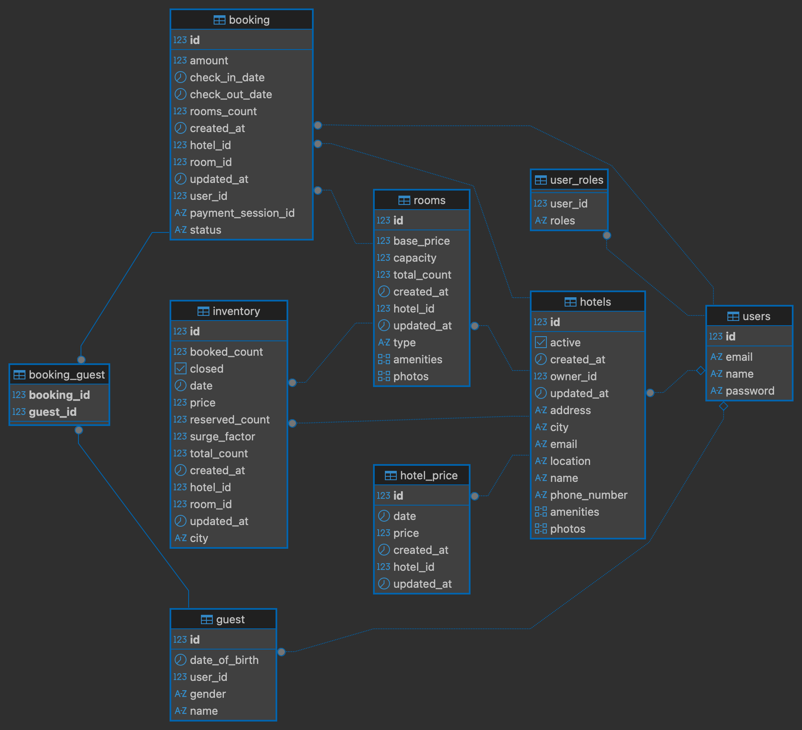

# Booking System


## Project Title
**Booking System** - Enterprise Hotel Management & Reservation Platform

## High-level Overview
The Booking System is a robust backend application designed to facilitate end-to-end hotel operations. It solves the complexity of managing hotel inventory, processing secure payments, and calculating dynamic pricing in real-time. The system serves as a centralized platform for hotel managers to control their assets and for users to seamlessly book accommodations. Its core objective is to provide a scalable, secure, and transactional consistent environment for high-volume booking scenarios.

## Architecture Overview
The application utilizes a **Layered Monolithic Architecture** built on the Spring Boot framework. This design was chosen to simplify deployment and development while maintaining clear separation of concerns.

- **Presentation Layer (Controllers)**: Handles HTTP requests, input validation, and maps JSON payloads to DTOs.
- **Service Layer (Business Logic)**: Contains the core domain logic, including booking workflows, state management, and strategy execution.
- **Persistence Layer (Repositories)**: Manages data access using Spring Data JPA with Hibernate.
- **Database**: Relational data storage using PostgreSQL.

### Design Patterns
- **Strategy Pattern (Pricing)**: Used to decouple pricing algorithms (`HolidayPricing`, `SurgePricing`) from the core booking logic, allowing new pricing models to be added without modifying existing code.
- **DTO Pattern**: Segregates internal JPA entities from external API contracts to prevent data leakage and ensure API stability.
- **Repository Pattern**: Abstracts the data access logic.

## Tech Stack

### Core Backend
- **Language**: Java 21
- **Framework**: Spring Boot 4.0.2
- **Build Tool**: Gradle 8.x

### Data & Persistence
- **Database**: PostgreSQL
- **ORM**: Spring Data JPA (Hibernate)

### Security & Authentication
- **Authentication**: JWT (JSON Web Tokens) via `jjwt` library
- **Security**: Spring Security (Stateless Session Management)
- **Password Hashing**: BCrypt

### Third-Party Integrations
- **Payments**: Stripe Java SDK (v31.3.0)

### Utilities
- **Mapping**: ModelMapper
- **Boilerplate Reduction**: Lombok
- **Configuration**: `java-dotenv`

## Project Structure

```
src/main/java/com/bookingsystem
├── config/                 # Application configuration (Stripe, Security, AppConfig)
├── controller/             # REST API Controllers (Entry points)
├── dto/                    # Data Transfer Objects (Request/Response models)
├── entity/                 # JPA Entities representing database tables
├── exception/              # Global exception handling and custom exceptions
├── repository/             # Spring Data interfaces for database access
├── security/               # JWT filters, entry points, and security constraints
├── service/                # Business logic interfaces
│   └── impl/               # Service implementations
└── strategy/               # Pricing strategy interfaces and implementations
```

## Setup Instructions

### Prerequisites
- JDK 21 installed.
- PostgreSQL database running locally or remotely.
- Gradle installed (or use the provided wrapper).
- A Stripe account for API keys.

### Environment Variables
Create a file named `.env` in the root directory or configure these variables in your environment.

| Variable | Description | Example |
|----------|-------------|---------|
| `DB_URL` | PostgreSQL Connection String | `jdbc:postgresql://localhost:5432/booking_db` |
| `DB_USERNAME` | Database User | `postgres` |
| `DB_PASSWORD` | Database Password | `secretpassword` |
| `JWT_SECRET` | 256-bit Secret Key for JWT | `your_secure_randomly_generated_key` |
| `JWT_EXPIRY` | Token Expiry in Ms | `86400000` |
| `STRIPE_KEY` | Stripe Secret API Key | `sk_test_...` |

### Database Setup
1. Create a database named `booking_db` in PostgreSQL.
   ```sql
   CREATE DATABASE booking_db;
   ```
2. The application is configured with `ddl-auto=update`, so tables will be created automatically upon the first run.

### Build and Run Instructions
1. **Compile the project**:
   ```bash
   ./gradlew clean build
   ```
2. **Run the application**:
   ```bash
   ./gradlew bootRun
   ```

## API Documentation

The API is structured around REST principles. All responses accept and return JSON.

### Base URL
`http://localhost:8080`

### Authentication Endpoints

| Method | Endpoint | Description | Auth Required |
|--------|----------|-------------|---------------|
| POST | `/auth/register` | Register a new user account | No |
| POST | `/auth/login` | Authenticate and receive an Access Token | No |

### Hotel Management (Admin)

| Method | Endpoint | Description | Auth Required |
|--------|----------|-------------|---------------|
| POST | `/admin/hotel` | Onboard a new hotel | Yes (HOTEL_MANAGER) |
| POST | `/admin/hotels/{id}/rooms` | Add inventory/rooms to a hotel | Yes (HOTEL_MANAGER) |
| PATCH | `/admin/hotel/{id}/status` | Activate or Deactivate a hotel | Yes (HOTEL_MANAGER) |

### Booking Operations

| Method | Endpoint | Description | Auth Required |
|--------|----------|-------------|---------------|
| POST | `/bookings/init` | Initialize a booking (Reserve inventory) | Yes |
| POST | `/bookings/{id}/addguest` | Add guest details to a booking | Yes |
| POST | `/bookings/{id}/payments` | Generate Stripe Checkout Session | Yes |
| POST | `/bookings/{id}/cancel` | Cancel an active booking | Yes |

### Search

| Method | Endpoint | Description | Auth Required |
|--------|----------|-------------|---------------|
| GET | `/hotels/search` | Search hotels by city, date, and guests | No |

## Database Design Overview

The database design prioritizes data integrity and locking mechanisms to prevent overbooking.

### Key Entities
- **User**: Stores authenticated user data and role mapping.
- **Hotel**: The root entity for property management.
- **Room**: Defines the configuration (capacity, type) of rooms in a hotel.
- **Inventory**: Represents specific availability for a Room on a specific Date. This table is pivotal for the locking mechanism.
- **Booking**: Manages the lifecycle and state of a reservation.

### Entity Relationship Diagram
See the visual representation of the schema below:



## Authentication & Authorization Strategy

The system uses **Stateless Authentication** with JWT (JSON Web Tokens).
1. **Login**: User submits credentials. Server validates and issues a signed JWT.
2. **Request**: Client sends the JWT in the `Authorization` header (`Bearer <token>`).
3. **Validation**: `JwtAuthFilter` intercepts requests, validates the signature, and sets the Security Context.

**Authorization** is enforced via Role-Based Access Control (RBAC):
- **GUEST**: Standard access to booking and search.
- **HOTEL_MANAGER**: Elevated access to administrative endpoints.

## Design Decisions & Tradeoffs

- **Granular Inventory Table**:
  - *Decision*: Inventory is stored as individual rows per room/date (e.g., Room 101 on 2024-01-01).
  - *Tradeoff*: This increases table size significantly (365 rows per room per year) but allows for extremely simple and robust row-level locking (`PESSIMISTIC_WRITE`) to guarantee consistency during concurrent bookings.
- **Strategy Pattern for Pricing**:
  - *Decision*: Pricing logic is split into small strategy classes.
  - *Tradeoff*: Increases the number of classes but makes the pricing engine highly testable and extensible without modifying the core service.
- **Monolithic Architecture**:
  - *Decision*: Kept as a single deployment unit.
  - *Tradeoff*: Simpler to develop and deploy than microservices, though potentially harder to scale individual components independently.

## Scalability Considerations
- **Stateless Service**: Since no session state is stored on the server, the application can be horizontally scaled behind a load balancer.
- **Database bottleneck**: The heavy reliance on database locking for inventory means the database will be the primary bottleneck. Read replicas could be introduced for the Search API (`GET`) to offload traffic from the primary writer node.

## Security Measures
- **Input Validation**: usage of `@Valid` and DTO constraints ensures malformed data is rejected early.
- **Exception Handling**: A global handler masks internal server errors and returns standardized error responses.
- **CORS/CSRF**: CSRF is disabled (standard for stateless APIs), and CORS is configurable.
- **Least Privilege**: Endpoints are strictly locked down by role.

## How to Run Tests
The project includes standard JUnit 5 tests.
```bash
./gradlew test
```

## Future Improvements
- **Caching**: Implement Redis to cache frequent search results (`/hotels/search`) to reduce DB read pressure.
- **Async Messaging**: Decouple the notification system (emails) using a message queue like RabbitMQ or Kafka.
- **Idempotency**: Implement idempotency keys for the booking endpoint to safely handle network retries.

## License
This project is proprietary and intended for educational or portfolio purposes. Use by permission only.
