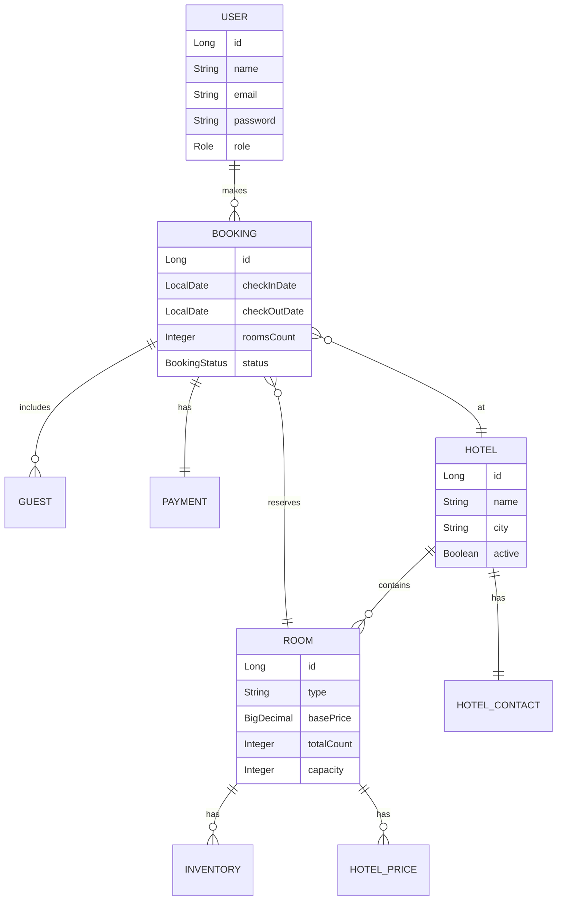

# 🏨 Hotel Booking System

A comprehensive, enterprise-grade Spring Boot application for hotel booking management. This system provides end-to-end functionality for hotel administration, room management, dynamic pricing, inventory tracking, and secure booking operations with JWT-based authentication.

---

## 📋 Table of Contents

- [Features](#-features)
- [Tech Stack](#-tech-stack)
- [Architecture](#-architecture)
- [API Documentation](#-api-documentation)
- [Security](#-security)
- [Dynamic Pricing](#-dynamic-pricing-strategy)
- [Getting Started](#-getting-started)
- [Project Structure](#-project-structure)

---

## ✨ Features

### 🔐 Authentication & Authorization
- **User Registration & Login**: Secure user onboarding with JWT tokens
- **Role-Based Access Control (RBAC)**: Two roles - `GUEST` and `HOTEL_MANAGER`
- **Stateless Security**: JWT-based authentication with no server-side sessions
- **Protected Endpoints**: Admin routes restricted to `HOTEL_MANAGER` role

### 🏨 Hotel Management
- **Hotel Onboarding**: Register hotels with contact info, photos, and amenities
- **Duplicate Prevention**: Smart validation based on Name + City combination
- **Lifecycle Management**: Activate/deactivate hotels with single API call
- **Cascade Operations**: Deleting a hotel cleans up all associated rooms and inventory

### 🛏️ Room Management
- **Hierarchical Structure**: Rooms are tightly coupled to parent Hotel
- **Capacity Planning**: Maintain total counts and guest capacity per room type
- **Strict Validation**: Constraints on pricing (non-negative), counts, and types

### 🔍 Hotel Search
- **City-Based Search**: Find available hotels by city and date range
- **Real-Time Availability**: Checks inventory against room requirements
- **Paginated Results**: Supports pagination for large result sets
- **Hotel Info Retrieval**: Get detailed hotel information by ID

### 📅 Booking System
- **Booking Initialization**: Create bookings with hotel, room, dates, and room count
- **Guest Management**: Add guest details to existing bookings
- **Booking Status Tracking**: Track through `RESERVED`, `GUESTS_ADDED`, `PAYMENT_PENDING`, `CONFIRMED`, `CANCELLED`
- **Payment Integration Ready**: Payment entity with status tracking

### 🔄 Automated Inventory System
- **Zero-Touch Initialization**: 
  - Creating a Room auto-generates inventory for next 365 days (if hotel is active)
  - Activating a Hotel backfills inventory for all its rooms
- **Consistent Cleanup**: Cascade deletion prevents orphaned inventory records

### 💰 Dynamic Pricing Engine
- **Strategy Pattern Implementation**: Flexible, pluggable pricing strategies
- **Multiple Pricing Factors**:
  - **Base Pricing**: Standard room rates
  - **Holiday Pricing**: Special rates for holidays
  - **Occupancy-Based**: Prices adjust based on room availability
  - **Surge Pricing**: Higher rates during peak demand
  - **Urgency Pricing**: Last-minute booking adjustments

---

## 🛠 Tech Stack

| Category | Technology |
|----------|------------|
| **Language** | Java 21 |
| **Framework** | Spring Boot 4.0.2 |
| **Database** | PostgreSQL |
| **ORM** | Spring Data JPA |
| **Security** | Spring Security + JWT (jjwt 0.13.0) |
| **Validation** | Jakarta Bean Validation |
| **Mapping** | ModelMapper 3.2.6 |
| **Build Tool** | Gradle |
| **Utilities** | Lombok, java-dotenv |

---

## 🏗 Architecture

```
┌─────────────────────────────────────────────────────────────────┐
│                      Controller Layer                           │
│  AuthController │ HotelController │ RoomController │ Booking... │
└────────────────────────────┬────────────────────────────────────┘
                             │
┌────────────────────────────▼────────────────────────────────────┐
│                       Service Layer                              │
│   AuthService │ HotelService │ RoomService │ BookingService      │
│                    InventoryService │ UserService                │
└────────────────────────────┬────────────────────────────────────┘
                             │
┌────────────────────────────▼────────────────────────────────────┐
│                      Repository Layer                            │
│   UserRepository │ HotelRepository │ RoomRepository              │
│        BookingRepository │ InventoryRepository │ ...             │
└────────────────────────────┬────────────────────────────────────┘
                             │
┌────────────────────────────▼────────────────────────────────────┐
│                       PostgreSQL                                 │
└─────────────────────────────────────────────────────────────────┘
```

### Design Patterns Used
- **Layered Architecture**: Controller → Service → Repository
- **DTO Pattern**: Request/Response DTOs for clean API contracts
- **Strategy Pattern**: Dynamic pricing with interchangeable algorithms
- **Repository Pattern**: Data access abstraction

---

## 📡 API Documentation

### Authentication Endpoints

| Method | Endpoint | Description | Access |
|--------|----------|-------------|--------|
| `POST` | `/auth/register` | Register new user | Public |
| `POST` | `/auth/login` | User login | Public |

#### Register User
**Request (`RegisterRequest`)**:
```json
{
  "name": "John Doe",
  "email": "john@example.com",
  "password": "securepass123"
}
```

---

### Hotel Management (Admin Only)

| Method | Endpoint | Description | Access |
|--------|----------|-------------|--------|
| `POST` | `/admin/hotel` | Create new hotel | `HOTEL_MANAGER` |
| `PUT` | `/admin/hotel/{id}` | Update hotel details | `HOTEL_MANAGER` |
| `PATCH` | `/admin/hotel/{id}/status` | Activate/Deactivate hotel | `HOTEL_MANAGER` |
| `DELETE` | `/admin/hotel/{id}` | Delete hotel | `HOTEL_MANAGER` |
| `GET` | `/admin/hotel/{id}` | Get hotel by ID | `HOTEL_MANAGER` |

#### Create Hotel
**Request (`HotelRequest`)**:
```json
{
  "name": "Grand Plaza",
  "city": "New York",
  "contact": {
    "address": "123 Broadway St",
    "phoneNumber": "+1 212-555-0199",
    "email": "contact@grandplaza.com",
    "location": "40.7128° N, 74.0060° W"
  },
  "photos": ["url1.jpg", "url2.jpg"],
  "amenities": ["Spa", "Gym", "Pool"]
}
```

**Response (`HotelResponse`)**:
```json
{
  "id": 101,
  "name": "Grand Plaza",
  "city": "New York",
  "active": false,
  "contact": { ... },
  "photos": [...],
  "amenities": [...]
}
```

---

### Room Management (Admin Only)

| Method | Endpoint | Description | Access |
|--------|----------|-------------|--------|
| `POST` | `/admin/hotels/{hotelId}/rooms` | Add room to hotel | `HOTEL_MANAGER` |
| `PUT` | `/admin/hotels/{hotelId}/rooms/{roomId}` | Update room | `HOTEL_MANAGER` |
| `DELETE` | `/admin/hotels/{hotelId}/rooms/{roomId}` | Delete room | `HOTEL_MANAGER` |
| `GET` | `/admin/hotels/{id}/rooms` | Get all rooms | `HOTEL_MANAGER` |

#### Create Room
**Request (`RoomRequest`)**:
```json
{
  "type": "Ocean View Suite",
  "basePrice": 250.00,
  "totalCount": 10,
  "capacity": 2,
  "photos": ["suite1.jpg"],
  "amenities": ["King Bed", "Mini Bar"]
}
```

**Response (`RoomResponse`)**:
```json
{
  "id": 505,
  "type": "Ocean View Suite",
  "basePrice": 250.00,
  "totalCount": 10,
  "capacity": 2,
  "photos": [...],
  "amenities": [...]
}
```

---

### Hotel Search (Public)

| Method | Endpoint | Description | Access |
|--------|----------|-------------|--------|
| `GET` | `/hotels/search` | Search available hotels | Public |
| `GET` | `/hotels/{hotelId}/info` | Get hotel info | Public |

#### Search Hotels
**Request (`HotelSearchRequest`)**:
```json
{
  "city": "New York",
  "startDate": "2026-03-15",
  "endDate": "2026-03-20",
  "roomsCount": 2,
  "page": 0,
  "size": 10
}
```

---

### Booking (Authenticated Users)

| Method | Endpoint | Description | Access |
|--------|----------|-------------|--------|
| `POST` | `/bookings/init` | Initialize booking | Authenticated |
| `POST` | `/bookings/{bookingId}/addguest` | Add guests to booking | Authenticated |

#### Initialize Booking
**Request (`BookingRequest`)**:
```json
{
  "hotelId": 101,
  "roomId": 505,
  "checkInDate": "2026-03-15",
  "checkOutDate": "2026-03-20",
  "roomsCount": 2
}
```

#### Add Guests
**Request (List of `GuestDto`)**:
```json
[
  {
    "name": "John Doe",
    "age": 30,
    "gender": "MALE"
  },
  {
    "name": "Jane Doe",
    "age": 28,
    "gender": "FEMALE"
  }
]
```

---

## 🔐 Security

### JWT Configuration
- **Stateless Sessions**: No server-side session management
- **Authorization Header**: `Bearer <token>`
- **Custom AuthEntryPoint**: Returns JSON error response for unauthorized access

### Endpoint Protection
```
/admin/**         → HOTEL_MANAGER role required
/bookings/**      → Authentication required
/users/**         → Authentication required
/auth/**          → Public access
/hotels/**        → Public access
```

### Password Security
- BCrypt password encoding
- Minimum 6 character password requirement

---

## 💰 Dynamic Pricing Strategy

The system implements the **Strategy Pattern** for flexible pricing calculations:

```
                    ┌─────────────────────┐
                    │  PricingService     │
                    └──────────┬──────────┘
                               │
           ┌───────────────────┼───────────────────┐
           │                   │                   │
           ▼                   ▼                   ▼
┌─────────────────┐ ┌─────────────────┐ ┌─────────────────┐
│ BasePricing     │ │ HolidayPricing  │ │ OccupancyPricing│
│ Strategy        │ │ Strategy        │ │ Strategy        │
└─────────────────┘ └─────────────────┘ └─────────────────┘

┌─────────────────┐ ┌─────────────────┐
│ SurgePricing    │ │ UrgencyPricing  │
│ Strategy        │ │ Strategy        │
└─────────────────┘ └─────────────────┘
```

### Available Strategies
| Strategy | Description |
|----------|-------------|
| **BasePricingStrategy** | Returns the standard room base price |
| **HolidayPricingStrategy** | Applies markup for holiday periods |
| **OccupancyPricingStrategy** | Adjusts price based on current occupancy rates |
| **SurgePricingStrategy** | Increases price during high-demand periods |
| **UrgencyPricingStrategy** | Applies urgency markup for last-minute bookings |

---

## 🚀 Getting Started

### Prerequisites
- Java 21+
- PostgreSQL 14+
- Gradle 8+

### Configuration

1. Create a `.env` file in the project root:
```bash
DB_URL=jdbc:postgresql://localhost:5432/booking_db
DB_USERNAME=postgres
DB_PASSWORD=yourpassword
JWT_SECRET=your-256-bit-secret-key
JWT_EXPIRY=86400000
```

2. Or update `src/main/resources/application.properties`:
```properties
spring.datasource.url=${DB_URL}
spring.datasource.username=${DB_USERNAME}
spring.datasource.password=${DB_PASSWORD}
spring.jpa.hibernate.ddl-auto=update
spring.jpa.show-sql=true
```

### Run Application
```bash
# Build the project
./gradlew build

# Run the application
./gradlew bootRun
```

The application will start at `http://localhost:8080`

---

## 📁 Project Structure

```
src/main/java/com/bookingsystem/
├── BookingSystemApplication.java    # Main entry point
├── config/                          # Application configurations
├── controller/                      # REST Controllers
│   ├── AuthController.java          # Authentication endpoints
│   ├── BookingController.java       # Booking operations
│   ├── HotelController.java         # Hotel CRUD (Admin)
│   ├── HotelSearchController.java   # Public hotel search
│   └── RoomController.java          # Room CRUD (Admin)
├── dto/                             # Data Transfer Objects
│   ├── *Request.java                # Input DTOs with validation
│   └── *Response.java               # Output DTOs for serialization
├── entity/                          # JPA Entities
│   ├── Booking.java
│   ├── Guest.java
│   ├── Hotel.java
│   ├── HotelContact.java
│   ├── HotelPrice.java
│   ├── Inventory.java
│   ├── Payment.java
│   ├── Room.java
│   ├── User.java
│   └── enums/                       # Enumerations
│       ├── BookingStatus.java
│       ├── Gender.java
│       ├── PaymentStatus.java
│       └── Role.java
├── exception/                       # Custom exceptions & handlers
├── repository/                      # Spring Data JPA repositories
├── security/                        # Security configuration
│   ├── SecurityConfig.java          # Main security setup
│   ├── jwt/                         # JWT utilities
│   │   └── JwtAuthFilter.java       # JWT authentication filter
│   └── service/                     # Auth services
│       └── AuthService.java
├── service/                         # Business logic layer
│   ├── BookingService.java
│   ├── HotelService.java
│   ├── InventoryService.java
│   ├── RoomService.java
│   ├── UserService.java
│   └── impl/                        # Service implementations
└── strategy/                        # Pricing strategies
    ├── PricingStrategy.java         # Strategy interface
    ├── PricingService.java          # Strategy orchestrator
    ├── PricingUpdateService.java    # Price update logic
    └── impl/                        # Strategy implementations
        ├── BasePricingStrategy.java
        ├── HolidayPricingStrategy.java
        ├── OccupancyPricingStrategy.java
        ├── SurgePricingStrategy.java
        └── UrgencyPricingStrategy.java
```

---

## 📊 Entity Relationships



---

## 📝 License

This project is for educational purposes.

---

## 🤝 Contributing

1. Fork the repository
2. Create a feature branch (`git checkout -b feature/amazing-feature`)
3. Commit your changes (`git commit -m 'Add amazing feature'`)
4. Push to the branch (`git push origin feature/amazing-feature`)
5. Open a Pull Request
