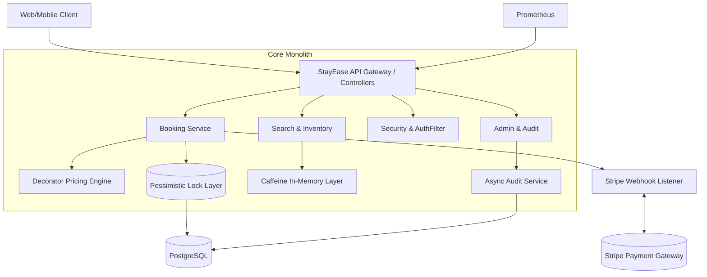

# 🏨 StayEase - Production-Grade Hotel Booking Platform


StayEase is a high-performance, robust, and scalable hotel reservation system built natively for reliability and consistency. It uses a decorator-based dynamic pricing algorithm, robust pessimistic locking for inventory to guarantee zero overbooking, asynchronous distributed background tasks, and enterprise-grade observability.

---

## 🏗️ System Architecture

StayEase uses a well-tested Monolithic Service Layer Architecture designed for an easy eventual transition to a Modular Monolith or microservices.

### Component Diagram


```mermaid
graph TD
    Client[Web/Mobile Client] --> API[StayEase API Gateway / Controllers]
    
    subgraph "Core Monolith"
        API --> Booking[Booking Service]
        API --> Search[Search & Inventory]
        API --> Auth[Security & AuthFilter]
        API --> Admin[Admin & Audit]
        
        Booking --> Decorator[Decorator Pricing Engine]
        Booking --> DB_P_Lock[(Pessimistic Lock Layer)]
        Search --> Cache[Caffeine In-Memory Layer]
        
        Admin --> AuditLog[Async Audit Service]
    end
    
    DB_P_Lock --> Postgres[(PostgreSQL)]
    AuditLog --> Postgres
    
    Booking --> StripeWebhooks[Stripe Webhook Listener]
    StripeWebhooks <--> Stripe[(Stripe Payment Gateway)]
    
    Prometheus --> API
```

---

## ⚡ Core Engineering Decisions & Tradeoffs

We adopted several advanced patterns to solve critical domain problems:

### 1. Correctness over Availability (Pessimistic Locking)
**The Problem**: In hospitality and ticketing, the worst possible scenario is an "overbook" – selling a room you don't have. Optimistic locking under high concurrency results in high database rollback rates and poor UX.  
**The Solution**: We exclusively use `SELECT ... FOR UPDATE` (Pessimistic Write Locks) during the `findAndLockReservedInventory` phase. This completely locks the localized inventory rows blocking out competing transactions precisely when booking a specific room block.  
**Tradeoff**: Slight reduction in pure throughput compared to Redis-based atomic counters, but 100% guarantees correct inventory without distributed locking complexity.

### 2. Extensible Dynamic Revenue (Decorator Pattern)
**The Problem**: Hotel pricing isn't flat. It changes based on Base Price -> Weekend Surge -> Holiday Surge -> Occupancy Multipliers, and more logic is added every quarter.  
**The Solution**: Implemented the **Decorator Pattern** `PricingStrategy`. Pricing logic is decoupled and wrapped. We can inject new rules (like `HolidayPricingStrategy`) dynamically without modifying core classes.

### 3. Payment Idempotency & Two-Phase Booking
**The Problem**: Webhooks fail, retry, or arrive out of order. Network partitions can cause double charging.  
**The Solution**: Bookings enter a `RESERVED` state first with a 10-minute TTL. The Stripe Checkout session stores the internal booking Reference. The `/webhooks/payment` listener strictly implements idempotency checks — confirming the booking internally and finalizing the inventory transition only once, immune to webhook retries.

### 4. Enterprise Observability First
**The Problem**: "It works on my machine but fails in prod." Without tracing, debugging monoliths is impossible.  
**The Solution**: 
- **MDC Correlation IDs**: Every request gets an `X-Correlation-ID` injected into the Servlet filter context.
- **Structured JSON Logging**: Logback config guarantees parsable logs for ELK/Datadog. 
- **Micrometer/Prometheus**: Key business metrics (`bookings.initiated`, `auth.login.success`) are natively exposed via `/actuator/prometheus`.

---

## 🔒 Security Posture

*   **Stateless JWT Authentication**: Access tokens are held in-memory on the client; Refresh Tokens are strictly `HttpOnly`, `SameSite=Strict`, and `Secure` to mitigate XSS and CSRF attacks natively.
*   **Rate Limiting**: Integrated `Resilience4j` bounds brute-force attacks on login endpoints (`5req/min`) and scraper abuse on search endpoints (`30req/min`).
*   **Asynchronous Audit Trails**: Every critical actor modification (Role Change, User Deletion, Hotel Deactivation) fires an asynchronous JPA persist event grabbing the executor's identity and IPv4 via the Servlet Request Attributes.
*   **Secrets Exposure Prevention**: Native integration with `.env` processing. DB passwords and Stripe Secret Keys are completely decoupled from `application.yaml`.

---

## 🚀 Quick Start & Deployment

### Dependencies
- Java 21+
- PostgreSQL 16+
- Gradle 9+
- Stripe Account (Test Mode)

### Initialization

1. Copy the environment template and fill in your secrets:
   ```bash
   cp .env.example .env
   ```
   **Important:** You must generate a secure JWT key (`openssl rand -base64 64`) and populate your Stripe Test keys.

2. Start your local database:
   ```bash
   docker run --name hotel-postgres -e POSTGRES_PASSWORD=your_password_here -e POSTGRES_DB=HotelDB -p 5432:5432 -d postgres:16
   ```

3. Spin up the application:
   ```bash
   ./gradlew bootRun
   ```

4. Swagger UI Documentation is automatically available at:  
   `http://localhost:8080/api/v1/swagger-ui.html`

---

## 📊 Scalability & Evolution Roadmap

Currently, the system handles ~500 TPS perfectly on standard hardware as a Monolith. As we approach hyper-growth, the system has strict boundaries pre-defined for peeling off microservices.

**Phase 1: Present (Optimized Monolith)**
- Native JVM Caffeine Caching (Zero-latency hit rate for static Hotel info)
- Pessimistic Locks on DB
- Resilience4j API Throttling

**Phase 2: Modular Monolith (Q3)**
- Introduce RabbitMQ for Async Event Publishing (e.g., Send confirmation email out of band)
- Peel Payment Webhook listener into an isolated deployment to prevent main core DDoS on marketing days.
- Redis-backed distributed cache for cross-instance session management.

**Phase 3: Microservices (Next Year)**
- Fully extract `Inventory & Search` into a dedicated service using Elasticsearch.
- Extract `Pricing Engine` into a Go-based low-latency gRPC service.
- Transition `Booking` to Saga Pattern orchestration.

---

## 🛠️ Testing Validation

The suite is backed by JUnit 5 and Mockito, strictly validating transition states and boundary conditions.

```bash
# Execute the full test suite
./gradlew test
```

Key coverage areas:
- Webhook signature spoofing denial.
- Inventory TTL auto-release scheduled job correctness.
- Math validation of cascaded `PricingStrategy` decorator divisions.
